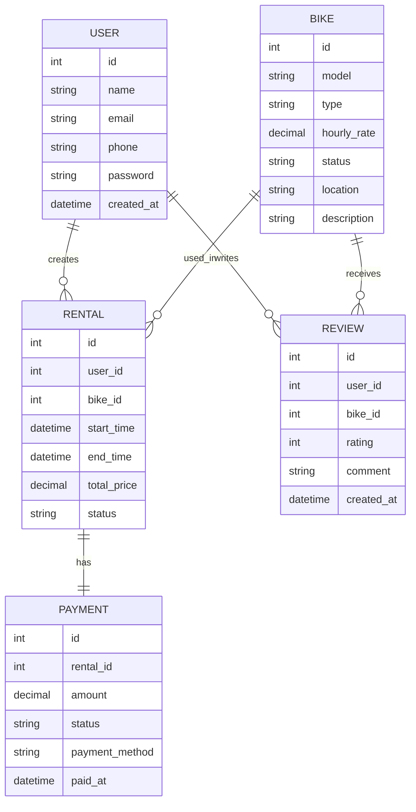

# Лабораторна робота №1  
## Частина 1. Вибір предметної області. Аналіз, моделювання та розроблення адаптивного web-застосунку

---

## Тема, Мета, Місце розташування

**Тема:** Вибір предметної області. Аналіз, моделювання та розроблення адаптивного web-застосунку.

**Мета:** Навчитися формулювати ключові складові опису інформаційної системи: актуальність, мету та завдання, об’єкт і предмет роботи, практичне значення, функціональні та нефункціональні вимоги, Use-case та ER-діаграми. Також на основі отриманих знань створити адаптивний веб-застосунок з використанням сучасних засобів верстки.

**Місце розташування:**

- **GitHub:** `https://github.com/timajan/rent-bike`

---

## Опис предметного середовища

### 1. Актуальність теми

Актуальність теми зумовлена потребою швидкого та зручного пересування у містах, де часто виникають затори, а також актуальними питаннями екологічності та здорового способу життя. Оренда велосипедів є доступним рішенням для коротких поїздок і подолання відстаней у межах району чи між найближчими локаціями. Важливість розробки саме зараз полягає в тому, що користувачам потрібен простий та адаптивний веб-інтерфейс, який дозволяє швидко обрати велосипед і оформити оренду з телефону, не встановлюючи окремий мобільний застосунок.

### 2. Об’єкт та предмет роботи

- **Об’єкт роботи:** інформаційна система у вигляді веб-застосунку, що забезпечує процес короткострокової оренди велосипедів та автоматизує взаємодію між клієнтом і сервісом прокату.

- **Предмет роботи:** властивості та характеристики веб-інтерфейсу, зокрема адаптивність, зручність використання, інтерактивність, а також логічна структура бази даних і базові алгоритми обробки процесу оренди.

### 3. Мета та завдання

**Мета:** створення функціонального та адаптивного веб-застосунку для оренди велосипедів, який коректно відображається на пристроях з різною роздільною здатністю та автоматизує основні процеси взаємодії користувача із сервісом.

**Завдання:**

1. Проаналізувати предметну область оренди велосипедів та визначити ключові правила бізнес-логіки.
2. Сформулювати функціональні та нефункціональні вимоги до веб-застосунку.
3. Побудувати Use-case діаграму для візуалізації взаємодії користувача із системою.
4. Спроєктувати ER-діаграму для формалізації структури зберігання даних.
5. Розробити адаптивний інтерфейс веб-застосунку з використанням сучасних засобів верстки.
6. Організувати файлову структуру проєкту та налаштувати контроль версій у GitHub.

---

## Хід виконання

### Крок 1: Аналіз предметної області

Було обрано предметну область **оренди велосипедів**. Система повинна забезпечувати користувачу можливість швидко знайти доступний велосипед, переглянути його характеристики, оформити оренду, завершити поїздку та здійснити оплату.

Основними учасниками системи є:

- користувач;
- адміністратор;
- платіжна система.

---

### Крок 2: Опис бізнес-логіки предметної галузі

Бізнес-логіка системи оренди велосипедів визначає правила, за якими працює сервіс прокату та взаємодіє з користувачем. Основу логіки становить процес короткострокової оренди велосипеда через веб-застосунок. Користувач повинен мати можливість швидко переглянути доступні велосипеди, ознайомитися з основною інформацією про них та оформити оренду.

Оренду може оформити лише зареєстрований користувач. Перед початком оренди система перевіряє, чи доступний вибраний велосипед для прокату. Якщо велосипед уже орендований або тимчасово недоступний, система не дозволяє розпочати нову оренду.

Після підтвердження оренди для користувача створюється активна сесія прокату, а статус велосипеда змінюється на **«орендований»**. Упродовж поїздки система враховує тривалість користування велосипедом і на її основі розраховує вартість оренди відповідно до обраного тарифу. Після завершення оренди система фіксує час завершення, обчислює підсумкову суму до оплати та змінює статус велосипеда на **«доступний»**, якщо він успішно повернений.

Система також повинна зберігати інформацію про користувачів, велосипеди, оренди та платежі. Після успішного завершення оренди користувач отримує підтвердження оплати, а інформація про завершену поїздку зберігається в історії. Додатково користувач може залишити відгук про стан велосипеда або якість сервісу.

#### Приклад правила бізнес-логіки

```ts
const calculatePrice = (minutes: number, rate: number): number => {
  const startPrice = 20; // фіксована ціна розблокування транспорту
  return startPrice + minutes * rate;
};
```

---

### Крок 3: Формування системних вимог

Система повинна бути реалізована у вигляді адаптивного веб-застосунку, доступного через браузер на комп’ютерах, планшетах і смартфонах. Інтерфейс має забезпечувати зручну навігацію між основними розділами: головною сторінкою, каталогом велосипедів, сторінкою деталей, формою оформлення оренди, сторінкою активної оренди та сторінкою завершення оплати.

Система повинна підтримувати реєстрацію та авторизацію користувачів. Для кожного користувача має зберігатися обліковий запис із базовими персональними даними, необхідними для роботи сервісу. Також система повинна мати механізм обліку доступних велосипедів із зазначенням їх характеристик, поточного статусу та тарифу.

Система повинна використовувати логічно організовану файлову структуру проєкту. HTML-документи, стилі CSS, JavaScript-файли та графічні ресурси мають зберігатися окремо.

---

### Крок 4: Функціональні вимоги

1. Система повинна дозволяти користувачу переглядати список доступних велосипедів.
2. Для кожного велосипеда має відображатися коротка інформація: модель, тип, тариф, статус доступності та характеристики.
3. Система повинна надавати можливість переходу на сторінку окремого велосипеда.
4. Система повинна дозволяти користувачу зареєструватися та увійти до особистого облікового запису.
5. Після авторизації користувач повинен мати можливість оформити оренду велосипеда.
6. Система повинна створювати нову сесію оренди після підтвердження вибору велосипеда.
7. Під час активної оренди застосунок повинен відображати час початку, тривалість та поточну вартість.
8. Система повинна дозволяти користувачу завершити оренду.
9. Після завершення система повинна автоматично обчислити вартість поїздки та відобразити підсумкову суму до оплати.
10. Система повинна забезпечувати можливість підтвердження оплати оренди.
11. Система повинна зберігати історію оренд користувача.
12. Система повинна дозволяти залишити відгук після завершення оренди.

---

### Крок 5: Нефункціональні вимоги

1. Інтерфейс веб-застосунку повинен бути адаптивним і коректно відображатися на екранах різної ширини.
2. Система повинна мати зручний та інтуїтивно зрозумілий інтерфейс.
3. Час завантаження основних сторінок не повинен перевищувати кількох секунд за нормального інтернет-з’єднання.
4. Система повинна забезпечувати надійне збереження даних про користувачів, оренди та платежі.
5. Код проєкту має бути логічно структурованим і придатним до подальшої підтримки.
6. Інтерфейс повинен бути сумісним із сучасними браузерами.
7. На мобільних пристроях навігаційне меню повинно трансформуватися у компактний формат.

---

### Крок 6: Побудова Use-case діаграми

Use-case діаграма відображає сценарії взаємодії користувачів із системою. Основними акторами є:

- **Користувач**
- **Адміністратор**
- **Платіжна система**


**Користувач** може:

- зареєструватися;
- увійти в систему;
- переглядати список доступних велосипедів;
- відкривати сторінку конкретного велосипеда;
- оформлювати оренду;
- переглядати активну оренду;
- завершувати поїздку;
- оплачувати оренду;
- переглядати історію оренд;
- залишати відгуки.

**Адміністратор** може:

- додавати нові велосипеди;
- редагувати інформацію про велосипеди;
- змінювати статус велосипедів;
- переглядати всі оренди.

**Платіжна система** бере участь у процесі оплати оренди.


---

### Крок 7: Опис ER-діаграми

ER-діаграма системи оренди велосипедів відображає основні сутності предметної області, їх атрибути та зв’язки між ними.

#### Основні сутності:

- **USER** — містить інформацію про користувача:
  - `id`
  - `name`
  - `email`
  - `phone`
  - `password`
  - `created_at`

- **BIKE** — описує велосипеди, доступні в системі:
  - `id`
  - `model`
  - `type`
  - `hourly_rate`
  - `status`
  - `location`
  - `description`

- **RENTAL** — фіксує факт оренди велосипеда:
  - `id`
  - `user_id`
  - `bike_id`
  - `start_time`
  - `end_time`
  - `total_price`
  - `status`

- **PAYMENT** — зберігає інформацію про оплату:
  - `id`
  - `rental_id`
  - `amount`
  - `status`
  - `payment_method`
  - `paid_at`

- **REVIEW** — містить відгуки користувачів:
  - `id`
  - `user_id`
  - `bike_id`
  - `rating`
  - `comment`
  - `created_at`

#### Зв’язки між сутностями:

- Один **USER** може мати багато **RENTAL**
- Один **BIKE** може брати участь у багатьох **RENTAL**
- Один **RENTAL** має один **PAYMENT**
- Один **USER** може залишити багато **REVIEW**
- Один **BIKE** може мати багато **REVIEW**

#### Приклад Mermaid-коду для ER-діаграми




---

### Крок 8: Організація структури проєкту

Було створено логічну файлову структуру проєкту:

- `/html` — для сторінок;
- `/css` — для стилів;
- `/js` — для інтерактивності;
- `/assets` — для зображень та іконок.

```bash
git init
git checkout -b develop
git checkout -b feature/header
```

Приклад базової структури:

```bash
rent-bike/
│
├── html/
│   ├── index.html
│   ├── catalog.html
│   ├── bike-details.html
│   ├── rental.html
│   └── profile.html
│
├── css/
│   └── style.css
│
├── js/
│   └── app.js
│
├── assets/
│   ├── images/
│   └── icons/
│
└── README.md
```

---

### Крок 9: Реалізація адаптивного інтерфейсу

Під час розробки інтерфейсу було передбачено такі основні блоки:

- **Header** — логотип, меню, кнопки входу/реєстрації;
- **Main** — основний контент сторінки;
- **Footer** — контактна інформація, посилання, копірайт.

Для забезпечення адаптивності використовувалися:

- Flexbox;
- CSS Grid;
- медіа-запити.

#### Приклад CSS для адаптивності

```css
.container {
  max-width: 1200px;
  margin: 0 auto;
  padding: 0 16px;
}

.bike-list {
  display: grid;
  grid-template-columns: repeat(3, 1fr);
  gap: 20px;
}

@media (max-width: 768px) {
  .bike-list {
    grid-template-columns: 1fr;
  }
}
```

---

## Висновок

У першій лабораторній роботі було проведено аналіз предметної області системи оренди велосипедів, визначено її актуальність, основних користувачів та ключові функції. Також було розглянуто основні бізнес-процеси системи, сформульовано функціональні та нефункціональні вимоги, описано Use-case та ER-діаграми. У результаті було підготовлено основу для подальшого проєктування та розробки адаптивного веб-застосунку.
